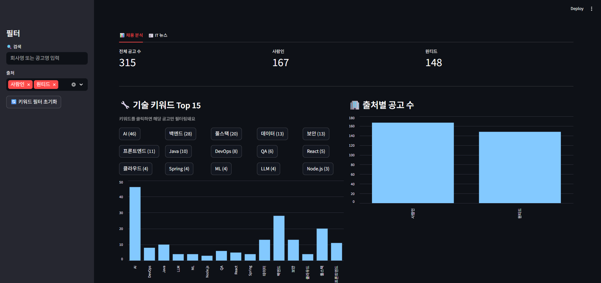
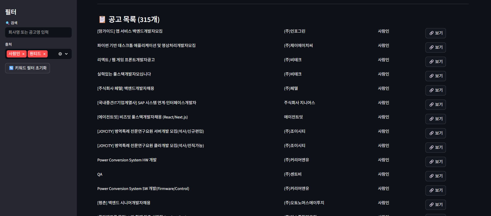
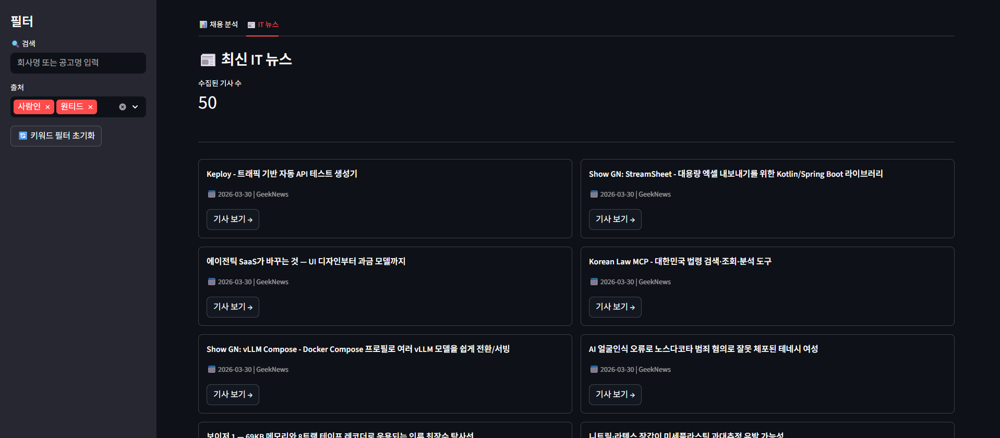

# 🖥️ IT 채용 대시보드

사람인, 원티드 채용공고와 GeekNews IT 뉴스를 자동 수집·분석하는 대시보드

## 📸 미리보기

### 채용 분석



### 공고 목록



### IT 뉴스



## 🛠️ 기술 스택

- **크롤링**: requests, BeautifulSoup4
- **데이터 처리**: pandas
- **대시보드**: Streamlit
- **자동화**: schedule

## 📁 프로젝트 구조

```
job-dashboard/
├── crawler/
│   ├── wanted_crawler.py    # 원티드 크롤러
│   ├── saramin_crawler.py   # 사람인 크롤러
│   ├── news_crawler.py      # GeekNews 뉴스 크롤러
│   └── merge.py             # 데이터 병합 및 중복 제거
├── data/                    # 수집된 데이터 저장
├── .streamlit/
│   └── config.toml          # Streamlit 테마 설정
├── app.py                   # 대시보드 메인
├── scheduler.py             # 자동 수집 스케줄러
└── requirements.txt
```

## ⚙️ 설치 및 실행

### 1. 가상환경 설정

```bash
python -m venv venv
venv\Scripts\activate  # Windows
source venv/bin/activate  # Mac/Linux
```

### 2. 라이브러리 설치

```bash
pip install -r requirements.txt
```

### 3. 데이터 수집

```bash
python crawler/saramin_crawler.py
python crawler/wanted_crawler.py
python crawler/news_crawler.py
python crawler/merge.py
```

### 4. 대시보드 실행

```bash
streamlit run app.py
```

### 5. 자동 수집 스케줄러 실행 (선택)

```bash
python scheduler.py
```

## 📊 주요 기능

- 사람인 + 원티드 IT 채용공고 자동 수집
- 중복 공고 제거 (사람인 우선)
- 기술 키워드 빈도 분석 및 시각화
- 키워드 클릭 필터링
- GeekNews 최신 IT 뉴스 카드형 표시
- 회사명/공고명 검색
